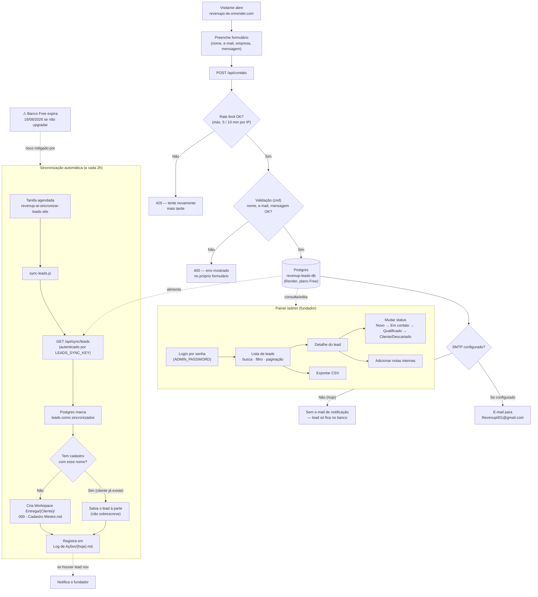

# Fluxograma — Site Institucional RevenUp (hoje)

**Versão:** 1.0\
**Status:** Documento Mestre\
**Referenciado por:** `README.md` (mesma pasta) e `AGENTS.md` v1.9

------------------------------------------------------------------------

## O que este fluxograma representa

Como o site publicado em https://revenups-ite.onrender.com funciona hoje,
de ponta a ponta: desde o visitante preenchendo o formulário até o lead
virar um cadastro permanente em `Workspace Entrega/`.

Versão em imagem (PNG) para visualização rápida, sem precisar renderizar
Mermaid: [`Fluxograma - Site RevenUp.png`](Fluxograma%20-%20Site%20RevenUp.png).

------------------------------------------------------------------------

## Legenda — passo a passo

**1. Captação (visitante → banco)**
O visitante preenche o formulário no site. O front-end (`public/contato.js`)
envia os dados para `POST /api/contato`. O backend aplica limite de
tentativas por IP (anti-spam) e validação de formato antes de gravar no
Postgres. Se `SMTP_*` estiver configurado no ambiente, um e-mail de
notificação também é enviado — hoje isso está **desativado** (nenhuma
credencial de e-mail foi configurada ainda).

**2. Gestão (fundador → painel)**
Em `/admin`, login por senha dá acesso à lista de leads: busca por
nome/e-mail/empresa, filtro por status, paginação, exportação CSV, e uma
página de detalhe por lead onde dá para mudar o status (funil comercial)
e escrever notas internas. Tudo isso é o mini-CRM.

**3. Sincronização (banco → Cérebro)**
De 2 em 2 horas, uma tarefa agendada roda `sync-leads.js`, que busca (via
API autenticada por chave própria) os leads ainda não sincronizados. Cada
um vira um cadastro real em `Workspace Entrega/{Cliente}/000 - Cadastro
Mestre.md` — o gatilho proativo do Fluxo C acontecendo automaticamente.
Isso existe porque o Postgres gratuito expira em 30 dias: depois de
sincronizado, o lead sobrevive no projeto para sempre, mesmo que o banco
no Render seja perdido.

**4. Registro (fluxo → governança)**
Cada sincronização com leads novos grava uma linha em
`01 - Raiz/Log de Ações/{hoje}.md` automaticamente — sem isso, o Fluxo B
(ciclo de aprendizado diário) não veria essa atividade.

------------------------------------------------------------------------

## O que ainda não está automatizado

- **E-mail de notificação por lead novo** — código pronto, só falta
  configurar `SMTP_*` no Render.
- **"Sono" do serviço após 15 min de inatividade** (plano free) — não
  resolvido; primeira visita depois de um tempo pode demorar ~50s.
- **Renovação do banco antes de expirar** (30 dias) — hoje depende de
  decisão manual do fundador (upgradar ou aceitar recriar o banco).
